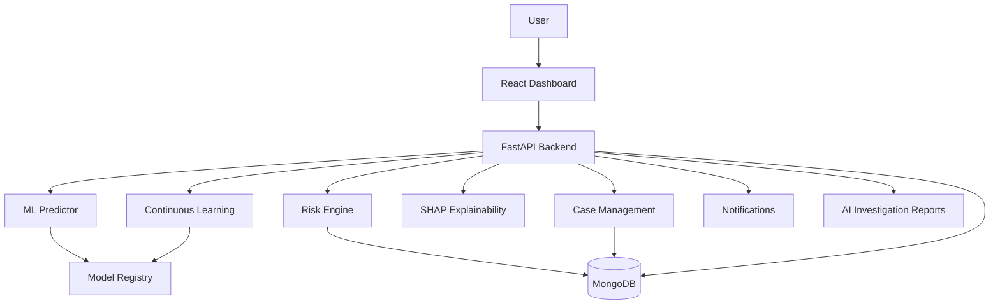

# FraudShield AI Enterprise

FraudShield AI Enterprise is a production-oriented fraud detection platform that combines FastAPI APIs, machine learning inference, explainability, case management, notifications, monitoring, and a React operations dashboard.

## Enterprise Architecture



## Technology Stack

- Python 3.12
- FastAPI and Uvicorn for the API service
- React, TypeScript, and Vite for the enterprise dashboard
- MongoDB for operational storage
- scikit-learn, pandas, NumPy, and SHAP for fraud modeling and explainability
- Pytest and pytest-cov for test automation
- Docker and Docker Compose for containerized deployment
- GitHub Actions for CI/CD

## Installation

```bash
python -m venv .venv
.venv\Scripts\activate
python -m pip install --upgrade pip
pip install -r requirements.txt
```

Run the API locally:

```bash
uvicorn app.api.main:app --host 0.0.0.0 --port 8000
```

Run the React dashboard locally:

```bash
cd frontend
npm install
npm run dev
```

The React dashboard runs at `http://localhost:5173`.

## Environment Variables

Create a `.env` file in the project root. Common values include:

```env
MONGODB_URI=mongodb://localhost:27017
DATABASE_NAME=fraudshield
JWT_SECRET_KEY=change-me
JWT_ALGORITHM=HS256
GROQ_API_KEY=
```

## API Endpoints

- `GET /` - API status
- `GET /health` - service health check
- `GET /version` - API, database, and ML pipeline version information
- Prediction routes - fraud scoring and inference workflows
- Authentication routes - login, JWT validation, and user access
- Feedback routes - continuous learning feedback capture
- Case management routes - case creation, investigation, and escalation

## Frontend

The main frontend lives in `frontend/`. It provides login, overview metrics, prediction, alerts, cases, AI report drafts, analytics, feedback, and settings pages.

## Model Comparison

The ML layer supports training, evaluation, registry, and version management workflows. Use the trainer and evaluator modules to compare candidate models on fraud metrics such as precision, recall, F1 score, ROC-AUC, and operational false-positive rate.

## SHAP Explainability

SHAP explainability is handled through the `app/xai/` module. It is intended to support feature-level explanations for predictions and investigation reports so analysts can understand why a transaction was flagged.

## Continuous Learning Workflow

1. Predictions and investigation outcomes are recorded.
2. Analyst feedback is collected through feedback routes and dashboard workflows.
3. Retraining jobs evaluate updated datasets against existing production models.
4. Approved artifacts are registered with version metadata.
5. The API and dashboard use the selected model version for future scoring.

## Docker Deployment

Build and run the API, React frontend, and MongoDB:

```bash
docker compose up --build
```

The API is exposed at `http://localhost:8000`, the React frontend at `http://localhost:5173`, and MongoDB at `localhost:27017`.

## CI/CD

GitHub Actions runs on pushes to `main` and `develop`, and on pull requests targeting `main`. The workflow installs dependencies, runs tests, generates coverage, and verifies the Docker build.

## Cloud Deployment

Recommended production deployment:

- FastAPI: Railway or Render
- React Dashboard: Vercel, Netlify, Render, or container hosting
- MongoDB: MongoDB Atlas
- Containerization: Docker
- CI/CD: GitHub Actions

## Future Enhancements

- Make all pytest tests pass consistently in CI.
- Clean up duplicate or obsolete predictor and test modules.
- Harden model versioning with immutable versioned artifacts.
- Add end-to-end API and dashboard smoke tests.
- Publish dashboard screenshots and deployment runbooks.
- Deploy API, dashboard, and managed MongoDB to cloud environments.
