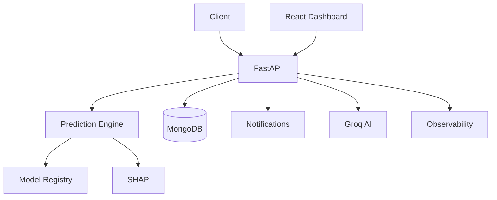

# Architecture

FraudShield AI Enterprise is organized around a FastAPI backend, React dashboard, MongoDB persistence layer, ML prediction engine, SHAP explainability, notification routing, and continuous learning workflow.

Core modules:

- `app/api`: REST endpoints and middleware.
- `app/ml` and `app/inference`: model training, registry, and runtime prediction.
- `app/database`: MongoDB connection and repository access.
- `app/monitoring`: health, system, and Prometheus-compatible metrics.
- `app/security`: API keys, rate limiting, sanitization, encryption helpers, and audit logs.
- `app/notifications`: email, Slack, Teams, Telegram, retry, priority routing, and history.
